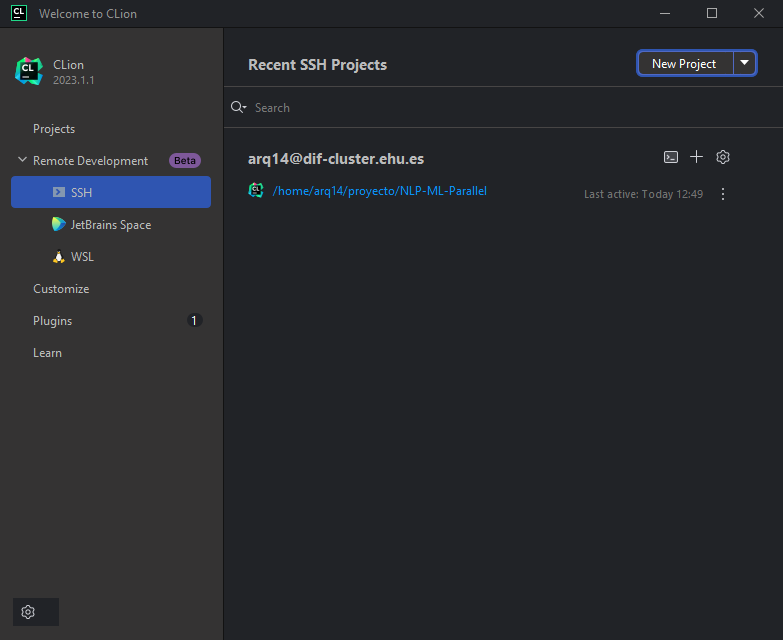
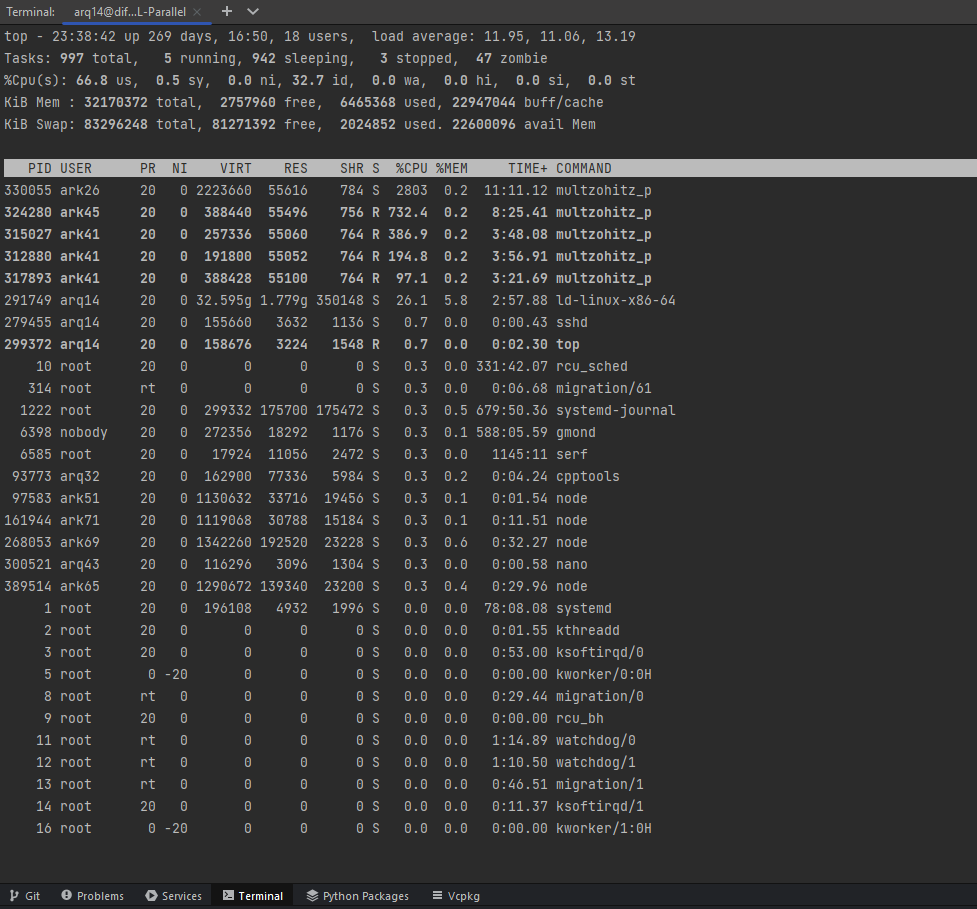
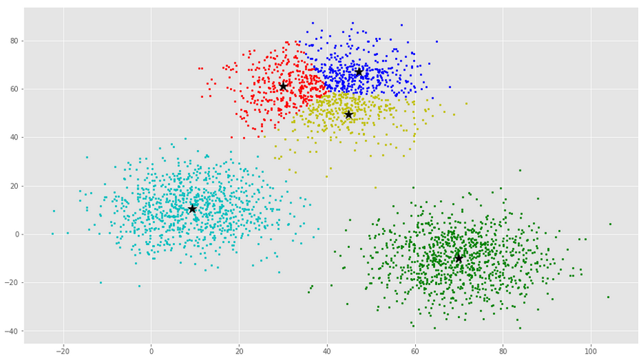
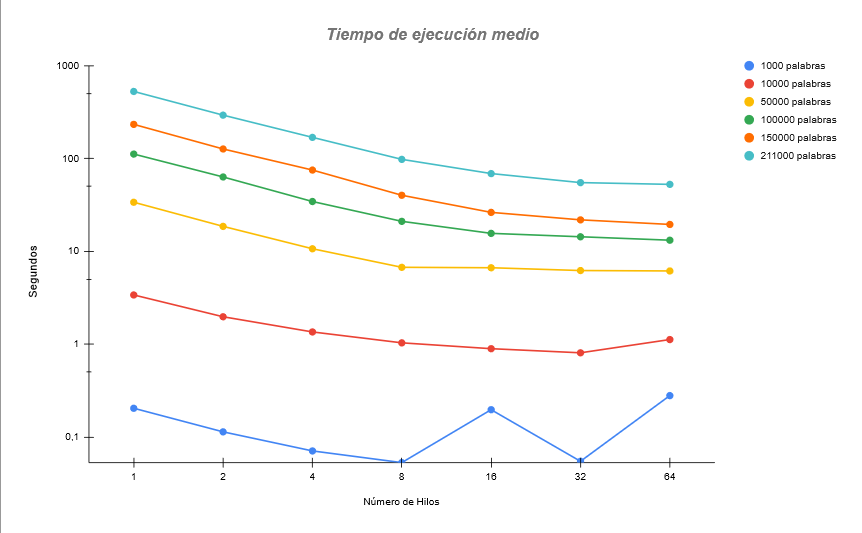

# 1.Introducción

En este proyecto se aborda el desarrollo de un sistema multiprocesador para procesamiento y el análisis de una gran cantidad de palabras, con el objetivo de lograr la mayor rapidez y eficiencia utilizando la librería OpenMP para el lenguaje de programación C. Para ello las palabras son diferenciadas en clusters/grupos conceptuales dependiendo de las características que tienen en común entre ellas utilizando el algoritmo de clustering K-means. Además cada uno de estos grupos de palabras se relaciona con uno de los 23 distintos campos de Unesco asociados a un campo de la ciencia o la tecnología, dependiendo de la mediana de las probabilidades de presencia del grupo en cada campo.

El objetivo principal del trabajo es conseguir la mayor eficiencia del programa, creando primero la versión en serie del programa y después la versión en paralelo para así, conseguir la mayor eficiencia posible, midiendo su velocidad media con 2,4,8,16,32,64 hilos y su factor de aceleración respecto a la versión en serie.

De esta manera se ha conseguido un programa capaz de procesar y gestionar de manera eficiente grandes cantidades de palabras, este tipo de prácticas son muy útiles en ramas como la ciencia de datos, Machine Learning e Inteligencia Artificial, entre otros muchos.

## 1.1. Herramientas y configuración del entorno de trabajo:

Para la realización del proyecto se han utilizado diferentes herramientas tanto de hardware como de software, además hemos utilizado una configuración del entorno de trabajo diferente a la mostrada en clase, aportándonos ciertas ventajas, como se explicará más adelante.

### **1.1.1. Hardware:**

La herramienta principal para llevar a cabo el trabajo ha sido el cluster de la universidad donde se han ejecutado las pruebas del proyecto para conectarnos al servidor.

### **1.1.2 Software:**

**Conexión SSH**:

SSH (Secure Shell) es un protocolo de red que permite a los usuarios acceder y controlar de manera segura sistemas remotos a través de una conexión encriptada. Para realizar esta conexión con el servidor cada integrante ha utilizado diferentes caminos.

1.  **Putty** para windows

2.  **Terminal** de Linux

3.  **WSL** para window y powershell

**Editor de código IDE**:

Una vez dentro del servidor empezamos a editar el código a través de la terminal gracias al editor NANO, esta es una aplicación sencilla y fácil de usar para editar archivos de texto directamente desde la línea de comandos. Nano proporciona funciones básicas de edición, como cortar, pegar, buscar, reemplazar y otras operaciones de manipulación de texto, pero es menos complejo que algunos otros editores de texto más avanzados, como por esa razón y por decisiones de comodidad para editar el código para nosotros decidimos empezar a utilizar el editor CLion de la empresa JetBrains, que es un entorno de desarrollo integrado diseñado específicamente para editar código en C y C++.\
Este cambio supuso ahorro de tiempo, además de que nos proporcionó ciertas ventajas con respecto a editar el código directamente desde la consola de comandos.

El editor Clion nos permite realizar conexiones SSH, para poder trabajar de manera remota, mediante un plugin ya integrado, ya que establece un backend en cluster.

Como complemento adicional, también nos permite realizar un seguimiento del estado de los recursos del cluster, dejando al usuario ver la carga de trabajo.

Esta función de CLion junto al comando de linux TOP para ver los procesos que más recursos consumen y la cantidad de usuarios conectados ha sido especialmente útil para saber cuál era el momento correcto de para hacer las ejecuciones de nuestro código y así sacar el tiempo real que tarda nuestro programa en analizar todas las palabras, aprovechando los momentos de menos carga de la CPU para hacer las pruebas. Normalmente entre las 2 a.m y las 10 a.m \newpage

# 2. Fundamentos teóricos:

## **2.1 OpenMP**

OpenMP (Open Multi-Processing) es una interfaz de programación de aplicaciones (API) utilizada para la programación paralela en sistemas multiproceso compartidos. Proporciona directivas de compilador, rutinas de biblioteca y variables de entorno que permiten escribir programas en paralelo de manera facil para lenguajes como C, C++ y Fortran.

Esta API nos permite especificar secciones de código que pueden ejecutarse en paralelo, lo que facilita la creación de programas que aprovechan los múltiples núcleos de una CPU o los recursos de un sistema multiproceso, en este caso el cluster que se nos proporciona por la universidad.

OpenMP sigue un modelo de programación de memoria compartida, donde los hilos comparten el mismo espacio de memoria.

{width="220"}

Una de las funciones que hemos utilizado a lo largo del proyecto ha sido set_omp_num_threads(), que permite establecer el número de hilos que se deben utilizar para ejecutar una tarea en paralelo. Además de esta función, OpenMP ofrece otras como omp_get_num_threads(), omp_get_thread_num() y omp_get_max_threads(), entre muchas otras.

Durante este proyecto nos hemos centrado en el uso de directivas que se indican mediante el uso de *pragma.* Estas directivas nos permiten crear regiones paralelas dentro de nuestro código donde trabajaran los nucleos asignados siguiendo el **modelo FORK-JOIN**. El uso de este modelo implica la creación de duplicados de un hilo, llamados hilos secundarios, los cuales se dedican a ejecutar una tarea simultáneamente al hilo principal o maestro. Una vez que los hilos secundarios han completado su tarea, se unen nuevamente al hilo maestro para continuar la ejecución del código en secuencia.

{width="381"}

## 2.2 Algoritmo de Clusterización:

**Algoritmo K-means**: Es el algoritmo no-supervisado que se utiliza para clasificar las distintas palabras en k grupos/clusters, es uno de los más utilizados en la comunidad científica.

Primero se escoge una cantidad k de puntos al azar (35 en nuestro caso), cada uno representa un centroide.

Después se aproxima cada elemento al grupo cuyo centroide más cerca se encuentra. A continuación, se reasigna cada centroide como la media de los puntos de ese grupo y se va repitiendo el proceso hasta que el algoritmo converge.

De esta manera tendremos k clusters cuyos centroides representen el centro de cada grupo.

## 2.3 Factor de aceleración:

Representa la diferencia de tiempo del programa en paralelo respecto al programa en serie.

## 2.4 Eficiencia:

Representa cómo de eficaz es el código paralelo respecto al código en serie.

# 3. Desarrollo del programa:

## 3.1. Código en serie:

La versión en serie del programa es el punto de partida de todo el proyecto, es por esto que es importante tomar el suficiente tiempo para entender la aplicación en general y crear correctamente las funciones de esta versión, ya que son la base para poder crear correctamente la versión paralela y lo que más carga de trabajo supone para nosotros a la hora de desarrollar este proyecto. Es importante destacar que en esta al ser una versión en serie esta no se beneficiara de la paralelización a la hora de ejecutarse ya que se basará en una ejecución **monohilo** y se ejecutará de manera **secuencial.**

Puede verse el análisis completo en el pdf README del proyecto. 

## 3.2. Código en paralelo:

Para la versión en paralelo hemos aplicado algunas directivas de la API de OpenMP en el código para así mejorara la eficiencia, consiguiendo unos resultados muy positivos que se analizaran más adelante. Se han papeletizado tanto el archivo gengrupos_s.c como fun_s.p convirtiéndose así en grupopal_p.c y fun_p.p.

puede verse el análisis completo en el pdf README del proyecto. 

## 3.3. Análisis de rendimiento:

Tras ejecutar el código aproximadamente 126 veces, (3 veces por numero de hilo para todas las cantidades de palabras, (1000,10000,50000,100000,150000) Se ha conseguido un tiempo de ejecucion medio mas fiable. Estas ejecuciones se han realizado durante el intervalo de tiempo desde las 5:30 de la mañana a las 11 de la mañana, ya que estas horas eran en las que el servidor tenia una menor carga de trabajo por el menor numero de gente conectada al mismo tiempo.

### 3.3.2.Tablas de rendimiento:

| **Número de hilos** | **tiempo medio - seg** | **Factor de aceleración - fa** | **Eficiencia** |
|------------------|-------------------|------------------------|------------------|
| **1**               | 0,2045223333           | 1                              | 1              |
| **2**               | 0,1138986667           | 1,79565169                     | 0,8978258452   |
| **4**               | 0,07096166667          | 2,882152336                    | 0,7205380839   |
| **8**               | 0,053108               | 3,851064498                    | 0,4813830622   |
| **16**              | 0,197286               | 1,036679406                    | 0,06479246289  |
| **32**              | 0,054858               | 3,728213448                    | 0,1165066703   |
| **64**              | 0,2798263333           | 0,7308902307                   | 0,01142015986  |

: Datos para 1000 palabras

| **Num Hilos** | **Tiempo medio - seg** | **Factor de aceleración - fa** | **Eficiencia** |
|------------------|--------------------|-----------------------|----------------|
| **1**         | 3,397133667            | 1                              | 1              |
| **2**         | 1,977941667            | 1,717509532                    | 0,8587547661   |
| **4**         | 1,357036333            | 2,503347614                    | 0,6258369034   |
| **8**         | 1,035660333            | 3,280161996                    | 0,4100202496   |
| **16**        | 0,8957333333           | 3,792572566                    | 0,2370357854   |
| **32**        | 0,8087993333           | 4,200218183                    | 0,1312568182   |
| **64**        | 1,123662333            | 3,023269149                    | 0,04723858046  |

: Datos para 10000 palabras

| **Num Hilos** | **Tiempo medio - seg** | **Factor de aceleración - fa** | **Eficiencia** |
|------------------|--------------------|-----------------------|-------------------|
| **1**         | 33,86656267            | 1                              | 1              |
| **2**         | 18,61722067            | 1,819098741                    | 0,9095493703   |
| **4**         | 10,68419233            | 3,169782199                    | 0,7924455497   |
| **8**         | 6,741596667            | 5,023522519                    | 0,6279403148   |
| **16**        | 6,668707333            | 5,078429893                    | 0,3174018683   |
| **32**        | 6,222542667            | 5,442560137                    | 0,1700800043   |
| **64**        | 6,159855333            | 5,497947733                    | 0,08590543333  |

: Datos para 50000 palabras

\pagebreak

| **Num Hilos** | **Tiempo medio - seg** | **Factor de aceleración - fa** | **Eficiencia** |
|------------------|--------------------|-----------------------|-------------------|
| **1**         | 111,861244             | 1                              | 1              |
| **2**         | 63,39620133            | 1,764478654                    | 0,882239327    |
| **4**         | 34,480404              | 3,244197603                    | 0,8110494007   |
| **8**         | 21,08529133            | 5,305178963                    | 0,6631473703   |
| **16**        | 15,64886233            | 7,148202957                    | 0,4467626848   |
| **32**        | 14,37963833            | 7,779141687                    | 0,2430981777   |
| **64**        | 13,20705867            | 8,469807459                    | 0,1323407415   |

: Datos para 100000 palabras

| **Num Hilos** | **Tiempo medio - seg** | **Factor de aceleración - fa** | **Eficiencia** |
|------------------|--------------------|----------------------|----------------|
| **1**         | 233,6102117            | 1                              | 1              |
| **2**         | 126,9208153            | 1,840598101                    | 0,9202990504   |
| **4**         | 75,23857233            | 3,104926162                    | 0,7762315406   |
| **8**         | 40,25129433            | 5,803793779                    | 0,7254742224   |
| **16**        | 26,33141067            | 8,871921623                    | 0,5544951015   |
| **32**        | 21,87637067            | 10,67865485                    | 0,333707964    |
| **64**        | 19,526835              | 11,96354717                    | 0,1869304246   |

: Datos para 150000 palabras

| **Num Hilos** | **Tiempo medio - seg** | **Factor de aceleración - fa** | **Eficiencia** |
|------------------|--------------------|----------------------|----------------|
| **1**         | 528,6664847            | 1                              | 1              |
| **2**         | 293,666635             | 1,800226589                    | 0,9001132946   |
| **4**         | 169,2776083            | 3,123073925                    | 0,7807684812   |
| **8**         | 98,062665              | 5,391108682                    | 0,6738885853   |
| **16**        | 68,95688533            | 7,666623603                    | 0,4791639752   |
| **32**        | 55,09080433            | 9,59627457                     | 0,2998835803   |
| **64**        | 52,742079              | 10,02361861                    | 0,1566190408   |

: Datos para 211000 palabras

### 3.3.3 Gráficos de los resultados y análisis:

**Tiempos:**

Para empezar con los análisis de los resultados obtenidos en las múltiples ejecuciones del programa en sus diferentes versiones, analizaremos los tiempos de ejecución de los programas. Cuando ejecutamos el programa en serie, vemos que el tiempo de ejecución se amplifica de manera significativa comparándola con la versión paralela de 8 o 64, por ejemplo. La diferencia más significativa se obtiene con 150000 y 211000 palabras, donde al aumentar "solo" 61000 palabras el tiempo de ejecución es 5 veces mayor.

Ahora comparemos este resultado con su versión paralela con más hilos, en este caso 64, que es 10 veces más rápida que su versión en serie. Por otro lado, vemos que la reducción de tiempo de ejecución se reduce a medida que el número de hilos es mayor. en el caso de 32 y 64 hilos por ejemplo es de 3 segundos pero la de 16 y 32 es de 8 en este caso. Esto nos da a entender que hay un límite en la mejora de los tiempos de ejecución.

Por último, debemos señalar que con 1000 palabras ha ocurrido una sobrecarga (con 16 no porque hemos realizado más pruebas, al ver que con 32 hilos no ocurría, y no da ese tiempo) al ejecutar el programa con 64 hilos, haciendo ineficiente y contraproducente la paralelización para ese tamaño de vector.

**Factor Aceleración:**

En cuanto al factor de aceleración, podemos observar el fenómeno descrito anteriormente, para 1000 palabras el factor de aceleración es menor que uno. Sin embargo, los resultados obtenidos para todos los demás son buenos y como los esperábamos, aunque para cualquier número de hilos en el programa con 211000 palabras vemos una bajada significativa en el factor de aceleración en cualquier número de los hilos.

**Eficiencia:**

Por último, en cuanto a la eficiencia de paralelización, observamos que cada vez que se aumenta la cantidad de hilos la eficiencia disminuye. Esto se debe a los tiempos de sincronización de los hilos. Por ejemplo con 2 hilos  la eficiencia ronda al 0,90 con cualquier tamaño del vector de palabras, sin embargo,  con 64 hilos la eficiencia es mucho menor. Además, podemos apreciar que la eficiencia en este caso aumenta progresivamente hasta llegar al máximo en 32 hilos.

# 4. Conclusión:

**Trabajo:**

En general, la paralelización ofrece mejoras significativas en tiempos de ejecución, pero estas mejoras tienen un límite y la escalabilidad no es proporcional al aumento de hilos. Se ha identificado un punto óptimo en el número de hilos que maximiza la eficiencia, y se observa que para ciertos tamaños de datos, como en el caso de 1000 palabras, la paralelización puede volverse contraproducente.

# 5. Bibiografía.

**References**

Atusy. (2019, April 18). *Number lines in code blocks with Rmarkdown*. Blog.atusy.net. <https://blog.atusy.net/submodules/rmd-line-num/>

*Cómo escribir sumatorias en LaTeX - Celeberrima.com*. (2019, June 26). Celeberrima. <https://www.celeberrima.com/como-escribir-sumatorias-en-latex/>

*eGela UPV/EHU: Resumen de OpenMP*. (n.d.). Egela.ehu.eus. Retrieved December 29, 2023, from <https://egela.ehu.eus/pluginfile.php/8442230/mod_resource/content/4/OpenMP3.1-CCard.pdf>

Geru. (2022, December 29). *Arquitectura paralela y clusterización de muestras genéticas*. GitHub. <https://github.com/geru-scotland/Genetics-parallel.> Con la colaboración de Ivan Clavo Bolado.

Microsoft. (n.d.). *Bing AI*. Bing. <https://www.bing.com/search?q=Bing+AI&showconv=1&FORM=hpcodx>

OpenAI. (2023). *ChatGPT*. Chat.openai.com; OpenAI. <https://chat.openai.com/>

RDTJr. (2021, February 21). *Rstudio pdflatex.exe did not succeed*. Stack Overflow. <https://stackoverflow.com/questions/66305985/rstudio-pdflatex-exe-did-not-succeed>

Sharma, S. (2023, February 9). *How to Add Bullet Points and Numbered Lists in Markdown*. It's FOSS. <https://itsfoss.com/markdown-lists/>

Xiong , Y. (2021, July 29). *Absolute Value Symbol in LaTeX*. LaTeX-Tutorial.com. <https://latex-tutorial.com/absolute-value-symbol/>
