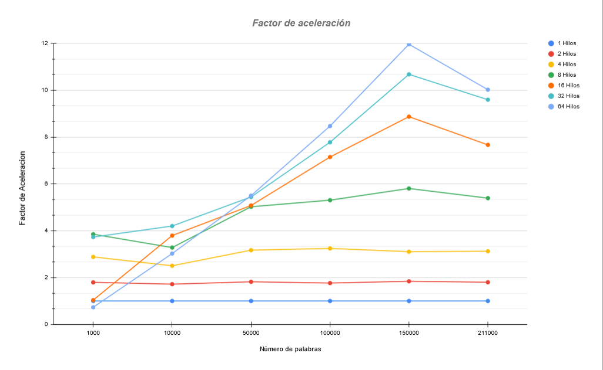

**PDF:**
<br />
<a href="[https://github.com/pixelpercebe/NLP-ML-Parallel-architecture/blob/main/README.pdf]">See project report/memory.</a>
<br />
# 1.Introducción

En este proyecto se aborda el desarrollo de un sistema multiprocesador para procesamiento y el análisis de una gran cantidad de palabras, con el objetivo de lograr la mayor rapidez y eficiencia utilizando la librería OpenMP para el lenguaje de programación C. Para ello las palabras son diferenciadas en clusters/grupos conceptuales dependiendo de las características que tienen en común entre ellas utilizando el algoritmo de clustering K-means. Además cada uno de estos grupos de palabras se relaciona con uno de los 23 distintos campos de Unesco asociados a un campo de la ciencia o la tecnología, dependiendo de la mediana de las probabilidades de presencia del grupo en cada campo.

El objetivo principal del trabajo es conseguir la mayor eficiencia del programa, creando primero la versión en serie del programa y después la versión en paralelo para así, conseguir la mayor eficiencia posible, midiendo su velocidad media con 2,4,8,16,32,64 hilos y su factor de aceleración respecto a la versión en serie.

De esta manera se ha conseguido un programa capaz de procesar y gestionar de manera eficiente grandes cantidades de palabras, este tipo de prácticas son muy útiles en ramas como la ciencia de datos, Machine Learning e Inteligencia Artificial, entre otros muchos.

## 1.1. Herramientas y configuración del entorno de trabajo:

Para la realización del proyecto se han utilizado diferentes herramientas tanto de hardware como de software, además hemos utilizado una configuración del entorno de trabajo diferente a la mostrada en clase, aportándonos ciertas ventajas, como se explicará más adelante.

### **1.1.1. Hardware:**

La herramienta principal para llevar a cabo el trabajo ha sido el cluster de la universidad donde se han ejecutado las pruebas del proyecto para conectarnos al servidor.

### **1.1.2 Software:**

**Conexión SSH**:

SSH (Secure Shell) es un protocolo de red que permite a los usuarios acceder y controlar de manera segura sistemas remotos a través de una conexión encriptada. Para realizar esta conexión con el servidor cada integrante ha utilizado diferentes caminos.

1.  **Putty** para windows

2.  **Terminal** de Linux

3.  **WSL** para window y powershell


**Editor de código IDE**:

Una vez dentro del servidor empezamos a editar el código a través de la terminal gracias al editor NANO, esta es una aplicación sencilla y fácil de usar para editar archivos de texto directamente desde la línea de comandos. Nano proporciona funciones básicas de edición, como cortar, pegar, buscar, reemplazar y otras operaciones de manipulación de texto, pero es menos complejo que algunos otros editores de texto más avanzados, como por esa razón y por decisiones de comodidad para editar el código para nosotros decidimos empezar a utilizar el editor CLion de la empresa JetBrains, que es un entorno de desarrollo integrado diseñado específicamente para editar código en C y C++.\
Este cambio supuso ahorro de tiempo, además de que nos proporcionó ciertas ventajas con respecto a editar el código directamente desde la consola de comandos.

El editor Clion nos permite realizar conexiones SSH, para poder trabajar de manera remota, mediante un plugin ya integrado, ya que establece un backend en cluster.


Como complemento adicional, también nos permite realizar un seguimiento del estado de los recursos del cluster, dejando al usuario ver la carga de trabajo.


Esta función de CLion junto al comando de linux TOP para ver los procesos que más recursos consumen y la cantidad de usuarios conectados ha sido especialmente útil para saber cuál era el momento correcto de para hacer las ejecuciones de nuestro código y así sacar el tiempo real que tarda nuestro programa en analizar todas las palabras, aprovechando los momentos de menos carga de la CPU para hacer las pruebas. Normalmente entre las 2 a.m y las 10 a.m


# 2. Fundamentos teóricos:

## **2.1 OpenMP**

OpenMP (Open Multi-Processing) es una interfaz de programación de aplicaciones (API) utilizada para la programación paralela en sistemas multiproceso compartidos. Proporciona directivas de compilador, rutinas de biblioteca y variables de entorno que permiten escribir programas en paralelo de manera facil para lenguajes como C, C++ y Fortran.

Esta API nos permite especificar secciones de código que pueden ejecutarse en paralelo, lo que facilita la creación de programas que aprovechan los múltiples núcleos de una CPU o los recursos de un sistema multiproceso, en este caso el cluster que se nos proporciona por la universidad.

OpenMP sigue un modelo de programación de memoria compartida, donde los hilos comparten el mismo espacio de memoria.

{width="220"}

Una de las funciones que hemos utilizado a lo largo del proyecto ha sido set_omp_num_threads(), que permite establecer el número de hilos que se deben utilizar para ejecutar una tarea en paralelo. Además de esta función, OpenMP ofrece otras como omp_get_num_threads(), omp_get_thread_num() y omp_get_max_threads(), entre muchas otras.

Durante este proyecto nos hemos centrado en el uso de directivas que se indican mediante el uso de *pragma.* Estas directivas nos permiten crear regiones paralelas dentro de nuestro código donde trabajaran los nucleos asignados siguiendo el **modelo FORK-JOIN**. El uso de este modelo implica la creación de duplicados de un hilo, llamados hilos secundarios, los cuales se dedican a ejecutar una tarea simultáneamente al hilo principal o maestro. Una vez que los hilos secundarios han completado su tarea, se unen nuevamente al hilo maestro para continuar la ejecución del código en secuencia.

{width="381"}


## 2.2 Algoritmo de Clusterización:

**Algoritmo K-means**: Es el algoritmo no-supervisado que se utiliza para clasificar las distintas palabras en k grupos/clusters, es uno de los más utilizados en la comunidad científica.

Primero se escoge una cantidad k de puntos al azar (35 en nuestro caso), cada uno representa un centroide.

Después se aproxima cada elemento al grupo cuyo centroide más cerca se encuentra. A continuación, se reasigna cada centroide como la media de los puntos de ese grupo y se va repitiendo el proceso hasta que el algoritmo converge.

De esta manera tendremos k clusters cuyos centroides representen el centro de cada grupo.


## 2.3 Factor de aceleración:

Representa la diferencia de tiempo del programa en paralelo respecto al programa en serie.

## 2.4 Eficiencia:

Representa cómo de eficaz es el código paralelo respecto al código en serie.


# 3. Desarrollo del programa:

## 3.1. Código en serie:

La versión en serie del programa es el punto de partida de todo el proyecto, es por esto que es importante tomar el suficiente tiempo para entender la aplicación en general y crear correctamente las funciones de esta versión, ya que son la base para poder crear correctamente la versión paralela y lo que más carga de trabajo supone para nosotros a la hora de desarrollar este proyecto. Es importante destacar que en esta al ser una versión en serie esta no se beneficiara de la paralelización a la hora de ejecutarse ya que se basará en una ejecución **monohilo** y se ejecutará de manera **secuencial.**

Para completar esta primera versión hemos tenido que implementar cuatro funciones además de un algoritmo de ordenación, que en nuestro caso el más conveniente nos ha parecido el algoritmo Quicksort

-   **Distancia entre dos palabras(distpal)**: Mediante esta función se calcula la distancia que hay entre dos palabras de 40 dimensiones, las palabras son tratadas como vectores y por ello se calcula la distancia Euclídea entre los dos.

    > *Esta función también se usará para calcular la distancia entre centroides, ya que un centroide también es un vector de 40 dimensiones aleatorio, es decir, aunque los valores del centroide no corresponden a ninguna palabra, se puede tratar como una en este contexto.*


    ``` {.c .numberLines .lineAnchors startFrom="1"}
    double distpal(float *vec1, float *vec2)
    {
      int i;
      double res = 0.0f;
      for (i=0;i<NDIM;i++)
        res += pow((double)(vec1[i] - vec2[i]),2);
      return sqrt(res);
    }
    ```


    **Explicación**: Se recorre la variable global ***NDIM***, que representa las dimensiones de las palabras y se suma en un variable tipo double la resta de cada par de dimensiones al cuadrado. Al final se devuelve la raíz cuadrada de esa suma.

$$dis(p,q) = \sqrt{\displaystyle\sum_{i=1}^n (p_{i} - q_{i})}$$


-   **Grupo más cercano(grupo_cercano):** Con este método hemos calculado cual es el grupo conceptual(cluster) más cercano a cada palabra, midiendo la distancia de cada palabra con el centroide de cada cluster.


    ``` {.c .numberLines .lineAnchors startFrom="1"}
    void grupo_cercano (int nvec, float mvec[][NDIM], float cent[][NDIM], int *popul){
      /*por cada centroide en cent comparar con un vector de mvec 
       *(un total de nvec) y guardar los que menos distancia tengan en popul,
       *teniendo un grupo de X vectores por cada centroide.*/
        double dist,distmin;
        int i, k;

        for (i = 0; i < nvec; i++) {
            distmin = DBL_MAX; 
          //cada vector se compara con la distancia maxima de un double (muy pequeño)
            for (k = 0; k < ngrupos; k++) { 
              //hay un total de ngrupos de centroides de NDIM dimensiones.
                dist = distpal(mvec[i], cent[k]);
                if (dist<distmin)
                {
                    distmin = dist;
                    popul[i] = k; 
                    /*guardamos el INDICE DEL CENTROIDE mas cercano, 
                     * es decir e indice del grupo. Eso para
                     *cada palabra/vector (nvec veces) cada palabra 
                     se asigna a un centro, al que este mas cerca.*/
                }
            }
        }
        // popul: grupo mas cercano a cada elemento
    }
    ```

  

    **Explicación:** Primero se recorren todas las palabras y se elige como distancia mínima un valor muy grande, después utilizando la función **distpal** anteriormente implementada, se calcula la distancia de cada palabra con todos los centroides, de manera que si la distancia calculada es menor que la valor muy grande que elegimos al inicio, este valor se actualiza, y el nuevo valor minimo sera la distacia calculada. Se repite el proceso con todas las palabras y se guarda el índice del centroide más cercano para cada palabra. Se guarda el indice de cada palabra (linea dentro del documento de palabras) dentro de un struct que representa al grupo.


-   **Índices de Validación de Clusters(silhouette_simple):** La validación de clústeres se refiere al procedimiento de evaluar la cohesión y separación de los clusters obtenidos mediante algoritmos de clusterización, con el fin de estimar su ajuste. En este proyecto, hemos usado la técnica del índice de Validación de Clusters o CVI (Cluster Validity Indexes). El valor de Silhouette se calcula para cada palabra y proporciona una medida de como de similar es una muestra de palabras a su propio clúster en comparación con otros clústeres cercanos. Se calcula utilizando la distancia intra-cluster $[a_{k}]$ y la distancia media al cluster más cercano diferente $[b_{k}]$ para cada muestra. El resultado sera el valor de Silhouette $S$ que varia entre $-1$ y $1$.

    > *Un valor de Silhouette cercano a 1 indica que la muestra está bien ajustada a su propio clúster y está separada de otros clústeres. Un valor cercano a 0 indica que la muestra está cerca del límite de decisión entre dos clústeres, mientras que un valor negativo indica que la muestra puede haber sido asignada al clúster incorrecto*

    Para calcular este índice, primero debemos definir lo que calculará el índice. Lo primero será la compactitud de cada clúster o grupo calculado como el promedio de las distancias entre pares de los elementos del grupo $[a_{k}]$ . En cambio, el cálculo de la separación de un cluster implica obtener el valor medio de las  distancias entre el centroide de un grupo específico y los centroides de los demás grupos denominado $[b_{k}]$.

    El valor $[a_{k}]$ es una estimación de la distancia intra-clúster del clúster $k$, determinando esto a través del cálculo promedio de todas las distancias entre los elementos que pertenecen a dicho clúster. Esta medida proporciona la cohesión o compacidad de los elementos dentro del clúster $k$.

    $$
        a(k) = \begin{cases}\frac{1}{\lvert c_k \rvert ^{2}} \sum_{x_i \in C_k} \sum_{x_j \in C_k} d(x_i, x_j) & |c_k| > 1, \\0 & |c_k| \leq          1.\end{cases}
    $$

    El valor $[b_{k}]$ representa una estimación de la distancia inter-clúster del clúster $k$. Para lograr esto, se realiza el promedio de todas las distancias entre el centroide del clúster $k$ y los demás centroides presentes. Esta medida nos proporciona una noción de qué tan distanciado se encuentra el clúster $k$ con respecto a los demás clústeres.

    $$
    b(k) = \displaystyle\frac{1}{\lvert C\rvert-1} \sum_{c_p \in C} d(c_k, c_p)
    $$

    La formula para calcular el valor de Silhouette $S$ es la siguiente:

$$
S = \frac{1}{|C|} \sum_{c_k \in C} s(k)
$$


El código:

``` {.c .numberLines .lineAnchors startFrom="1"}
    double silhouette_simple(float mvec[][NDIM], struct lista_grupos *listag, 
      float cent[][NDIM], float a[]){

      //medias distancia inter - cluster para cada cluster.
      float b[ngrupos]; 
      //s: suma de los ratios ; max : el maximo entre la media intercluster e intra cluster.
      float s, max; 
      //k : cluster ; i : palabras ; j : mismo tipo que su bucle anterior, solo en anidados.
      int i,j,k; 
      //suma de las distancias, inter e intra cluster.
      double sumdist; 

      for (i = 0; i<ngrupos;i++)b[i] = 0.0f;
      for (i = 0; i<ngrupos;i++)a[i] = 0.0f;
      max = 0.0f;
      //aproximar a[i] de cada cluster: calcular la densidad de los grupos;
      //media de las distancia entre todos los elementos del grupo;
      //si el numero de elementos del grupo es 0 o 1, densidad = 0
      for (k = 0; k < ngrupos ; k++) {
          sumdist = 0;
          for (i = 0; i < listag[k].nvecg; i++) {
              for (j = i + 1; j < listag[k].nvecg; j++) {
                  sumdist += distpal(mvec[listag[k].vecg[i]],mvec[listag[k].vecg[j]]);
              }
          }
          if (listag[k].nvecg > 1) {
              /*el vector esta inicializado a 0 
               *no hace falta hacer nada si el cluster contiene <= 1 vector.*/
              a[k] = sumdist / (float)(listag[k].nvecg);}
      }
      //aproximar b[k] de cada cluster
      for(k = 0;k<ngrupos;k++){
          sumdist = 0;
          for(j = k+1; j<ngrupos;j++)
          {
              sumdist += distpal(cent[k], cent[j]);
          }
          b[k] = sumdist / ngrupos;
      }
      // calcular el ratio s[k] de cada cluster
      for (k= 0;k < ngrupos; k++)
      {
          max = MAX(a[k],b[k]);
          if( max != 0.0f){
              s += (float)(b[k] - a[k] / max); 
              //se suma cada ratio, sin necesidad de guardarlo.
          }
      }
      /*se devuelve la media que indica la calidad de la particion 
      *(la suma de los ratios s[k] entre el num. de centroides.)*/
      return (double)(s/(float)ngrupos);
    }
```

**Explicación:** Primero se inicializan los arrays `a` y `b` donde se van a guardar las distancias intra e inter cluster. Después se recorre las palabras de cada cluster para calcular la distancia intra-cluster y rellenar el array `a` de datos. Como se puede observar, el bucle exterior recorre los clusters de palabras, mientras que los bucles anidados recorren las palabras dentro del cluster que se está iterando. El segundo bucle recorre todas las palabras del cluster mientras que el tercero solo las palabras que aún no se han iterado por el segundo bucle. Esto se realiza de esta manera debido a que si iteramos en el tercer bucle todas las palabras por cada palabra iterada en el segundo bucle, estaríamos calculando las mismas distancias en sentidos contrarios y nos saldrán los datos por duplicado. Esta misma manera de iterar se utiliza al recorrer los clusteres para calcular la distancia entre ellos y asi conseguir las distancias inter-cluster. Por último se calcula el ratio o valor silhouette `S` siguiendo la fórmula para, por ultimo, devolver la media.

Para calcular `S` también hemos implementado la siguiente definición de una función que calcula el máximo entre dos floats:

``` {.c .numberLines .lineAnchors startFrom="1"}
  #define MAX(i, j) (((i) > (j)) ? (i) : (j))
```

-   **Analisis de Campos (analisis_campos):** Esta función se encarga de asignar un campo UNESCO a cada palabra. Examinando cada grupo, es necesario determinar, en el contexto del campo UNESCO, qué grupo se encuentra más próximo (en su mínima distancia) y cuál está más alejado (en su máxima distancia). Esta evaluación se realizará empleando la mediana de las distancias que conectan un grupo con un campo UNESCO específico. Para este propósito, se hará uso de la función 'analisis_campos' para calcular la cercanía representativa de un grupo hacia un campo UNESCO determinado basándose en estas distancias.

    \vspace{0.5cm} \newpage

``` {.c .numberLines .lineAnchors startFrom="1"}
  void analisis_campos(struct lista_grupos *listag, float mcam[][NCAM],
    struct analisis *info_cam){
    //i : palabras ; k : cluster; cam : Campo UNESCO.
    int i,cam,k;
    /*mediana del los valores de la relaciones al campo 
     *en una columna de todas las palabras de un grupo.*/
    float mediana; 
    //apuntador al primer valor de las relaciones de las palabras de un cluster con un campo.
    float *relacion; 

    for (int i = 0; i<NCAM ; i++)
    {
        info_cam[i].mmin = FLT_MAX;
        info_cam[i].mmax = 0.0f;
    }
    for(k=0; k < ngrupos; k++)
    {
        for (cam = 0; cam < NCAM; cam ++)
        {
            /**en vez de hacer un array con el numero maximo de palabras como tamaño maximo,
             * reservamos espacion en memoria por cada cluster
             * y solo para los elementos de ese cluster.*/

            relacion = malloc(sizeof (float) * listag[k].nvecg);
            for (i=0;i<listag[k].nvecg; i++)
            {
                relacion[i] = 0.0f;
            }
            for (i = 0; i < listag[k].nvecg; i++ )
            {
                //guardamos las relaciones de cada palabra cone el campo.
                relacion[i] = mcam[listag[k].vecg[i]][cam];
            }
            //ordenar y calcular la media
            mediana= sort_and_median(listag[k].nvecg, relacion);
            printf("\nmediana: %f", mediana);
            /*ahora tenemos la media de las relaciones de 
             *las palbras de este cluster con repsecto a este campo.*/
            //comprobamos si es minimo o maximo y actalizamos si lo es.
            if( mediana > 0 && mediana < info_cam[cam].mmin)
            {
                info_cam[cam].mmin = mediana;
                info_cam[cam].gmin = k;
            }
            if(mediana > info_cam[cam].mmax)
            {
                info_cam[cam].mmax = mediana;
                info_cam[cam].gmax = k;
            }
            free(relacion);
        }
    }
  }
```


**Explicación:** Comienza inicializando valores en una estructura y luego itera a través de los grupos y campos. En cada iteración, calcula la mediana de las relaciones entre palabras y campos, actualizando los valores mínimos y máximos según sea necesario en la estructura de información. Esto se realiza para cada grupo y campo, utilizando la función `sort_and_median` para calcular la mediana de las relaciones. Además, imprime la mediana en cada iteración para propósitos de seguimiento o depuración.

## 3.2. Código en paralelo:

Para la versión en paralelo hemos aplicado algunas directivas de la API de OpenMP en el código para así mejorara la eficiencia, consiguiendo unos resultados muy positivos que se analizaran más adelante. Se han papeletizado tanto el archivo gengrupos_s.c como fun_s.p convirtiéndose así en grupopal_p.c y fun_p.p.

Se van a analizar los procesos que se han seguido y las directivas y cláusulas diferentes utilizadas. Se explicará cada una vez debido a que su uso es muy repetido y siempre funcionan de la misma manera.

-   **grupopal_p.c:**

    Principalmente se han buscado bucles con un alto coste algoritmico o que trabajaran con arrays y calculos apilados de variables. Por ese motivo en este archivo solo se ha paralelizado un numero muy reducido de bucles.


    ``` {.c .numberLines .lineAnchors startfrom="1"}
    // B: Calcular la "calidad" del agrupamiento
    // =========================================
    // lista de clusters: numero de elementos y su clasificacion
    #pragma omp parallel default(none) private(i,grupo) shared(listag,popul,nvec,ngrupos)
        {
    #pragma omp for
            for (i = 0; i < ngrupos; i++) listag[i].nvecg = 0;
    #pragma omp for
            for (i = 0; i < nvec; i++)
            {
                grupo = popul[i];
    #pragma omp critical
                {
                    listag[grupo].vecg[listag[grupo].nvecg] = i; 
    // vectores de cada grupo (cluster)
                    listag[grupo].nvecg++;
                }
            }
        }//fin de la region paralela
    ```

    **`OMP_PARALLEL:`** Establece el inicio de una region paralela acotada por llaves, crea los hilos y mediante diferentes clausulas especifica como se van a tratar las variables y los bucles por cada hilo.

    **`OMP_CRITICAL:`** Esta cláusula se utiliza para asegurar que solo un hilo a la vez pueda ejecutar un bloque de código específico dentro de una región paralela, evitando condiciones de carrera o problemas de concurrencia.

-   **fun_p.c:**

    -   **`distpal():`** Esta función no se paralelizara debido a en ella se realiza una operación computacionalmente liviana, ya que implica operaciones matemáticas simples (suma y potenciación). Si la ejecución de la función es rápida y el procesamiento no es intensivo, paralelizarla podría introducir cierta sobrecarga debido al manejo de hilos y la sincronización, lo que potencialmente podría ralentizar el rendimiento general.

    -   **`grupo_cercano():`** esta función realiza un cálculo de distancias entre un conjunto de vectores `mvec` y un conjunto de centroides `cent`. debidoo a que se realizan comparaciones entre múltiples vectores, puede resultar en una carga computacional alta. Por ello se utiliza la directiva `#pragma omp parallel for` para realizar un bucle paralelo sobre los vectores en `mvec`. Paralelizar este proceso puede acelerar significativamente el tiempo de ejecución al distribuir la carga de trabajo entre múltiples hilos, lo que permite calcular las distancias de manera concurrente y reducir el tiempo total de ejecución.\
        la paralelización se ha hecho sobre el bucle exterior (`for (i = 0; i < nvec; i++)`), permitiendo que las operaciones dentro de cada iteración se ejecuten en paralelo, lo que puede mejorar el rendimiento general.

        ``` {.c .numberLines .lineAnchors startfrom="1"}
        void grupo_cercano (int nvec, float mvec[][NDIM], float cent[][NDIM], int *popul){
        //por cada centroide en cent comparar con 
        //un vector de mvec (un total de nvec) y guardar los que menos distancia
        //tengan en popul, teniendo un grupo de X vectores por cada centroide.
            double dist,distmin;
            int i, k;
        #pragma omp parallel for default(none) 
            shared(nvec,ngrupos,mvec,cent,popul) private(distmin,dist,i,k)
                for (i = 0; i < nvec; i++) {
                    distmin = DBL_MAX; 
                  //cada vector se compara con la distancia maxima de un double
                    for (k = 0; k < ngrupos; k++) { 
                      //hay un total de ngrupos de centroides de NDIM dimensiones.
                        dist = distpal(mvec[i], cent[k]);
                        if (dist<distmin)
                        {
                            distmin = dist;
                            popul[i] = k; 
                            /*guardamos el INDICE DEL CENTROIDE mas cercano
                             *es decir e indice del grupo. Eso para
                             *cada palabra/vector (nvec veces) cada 
                             *palabra se asigna a un centro, al que este mas cerca.*/
                        }
                    }
                }
            // popul: grupo mas cercano a cada elemento
        }
        ```


    -   **`silhouette_simple():`** En esta función las secciones que calculan `a[i]` y `b[i]` pueden ser paralelizadas eficientemente utilizando OpenMP debido a su naturaleza independiente. Sin embargo, el cálculo de `s` y el promedio final no pueden paralelizarse de manera directa debido a las dependencias entre las iteraciones.\
        `a[i]`: Calcula la densidad intra-cluster promedio para cada grupo. Cada iteración del bucle `for` calcula una `a[i]`. El cálculo se puede realizar en paralelo, ya que cada índice `i` es independiente del otro.

        `b[i]`: Calcula la densidad inter-cluster promedio. Esta sección también puede paralelizarse, ya que cada `b[i]` se calcula independientemente de otros índices.

        Se ha utilizado la clausula `reduction` en los bucles que calculan los datos para `a` y `b`, esta clausula se utiliza para realizar operaciones de reducción, como sumas o productos, de manera eficiente y segura.

        Después de calcular todas las `a[i]` y `b[i]`, se realiza un bucle para calcular la medida de silhouette para cada grupo. Cada iteración del bucle depende de las variables `a[i]` y `b[i]`, por lo que no se puede paralelizar de manera directa. El resultado de cada cálculo se suma a `s`, lo cual puede hacerse de manera concurrente.

        Después de calcular `s`, se realiza un cálculo final para obtener el valor promedio de silhouette. Este proceso no se puede paralelizar ya que implica un bucle con dependencias entre las iteraciones.

        Las secciones críticas son protegidas utilizando `nowait` para evitar bloqueos entre los hilos. Indica que el hilo que realiza la paralelización no debe esperar a que todos los hilos terminen su sección paralela antes de continuar. Es útil en situaciones donde, al finalizar la sección paralela, no hay dependencias que requieran la sincronización de todos los hilos. Al no esperar a que todos los hilos finalicen su trabajo, el hilo maestro (el hilo que ha creado el equipo de hilos) puede continuar ejecutando su trabajo sin tener que esperar a que todos los hilos secundarios finalicen.

        ``` {.c .numberLines .lineAnchors startfrom="1"}
        double silhouette_simple(float mvec[][NDIM], struct lista_grupos *listag, float cent[][NDIM], float a[]){
            //medias distancia inter - cluster para cada cluster.
            float b[ngrupos]; 
            //s: suma de los ratios ; max : el maximo entre la 
            //media intercluster e intra cluster de un cluster.
            float s, max;
            //k : cluster ; i : palabras ; 
            //j : mismo tipo que su bucle anterior, solo en anidados.
            int i,j,k; 
            //suma de las distancias, inter e intra cluster.
            double sumdist; 
            max = 0.0f;
        #pragma omp parallel default(none) 
            shared(ngrupos,mvec,listag, cent,a,b, sumdist) private(i,k,j)
            {
        #pragma omp for
                for (i = 0; i < ngrupos; i++)b[i] = 0.0f;
        #pragma omp for
                for (i = 0; i < ngrupos; i++)a[i] = 0.0f;

                //aproximar a[i] de cada cluster: calcular la densidad de los grupos;
                //media de las distancia entre todos los elementos del grupo;
                //si el numero de elementos del grupo es 0 o 1, densidad = 0
        #pragma omp for nowait reduction(+:sumdist)
                for (k = 0; k < ngrupos; k++) {
                    sumdist = 0;
                    for (i = 0; i < listag[k].nvecg; i++) {
                        for (j = i + 1; j < listag[k].nvecg; j++) {
                            sumdist += distpal(mvec[listag[k].vecg[i]], mvec[listag[k].vecg[j]]);
                        }
                    }
                    if (listag[k].nvecg > 1) {
                        /*el vector esta inicializado 
                         *a 0 no hace falta hacer nada si 
                         *el cluster contiene <= 1 vector.*/
                        a[k] = sumdist / (float) (listag[k].nvecg);
                    }
                }

                //aproximar b[k] de cada cluster
        #pragma omp for nowait reduction(+:sumdist)
                for (k = 0; k < ngrupos; k++) {
                    sumdist = 0;
                    for (j = k + 1; j < ngrupos; j++) {
                        sumdist += distpal(cent[k], cent[j]);
                    }
                    b[k] = sumdist / ngrupos;
                }
            }

            // calcular el ratio s[k] de cada cluster
            s= 0.0f;
            for (k = 0; k < ngrupos; k++) {
                max = MAX(a[k], b[k]);
                if (max != 0.0f) {
                    s += (float) (b[k] - a[k] / max); 
                  //se suma cada ratio, sin necesidad de guardarlo.
                }
            }
            /*se devuelve la media que indica la calidad de la particion 
             * (la suma de los ratios s[k] entre el num. de centroides.)*/
            return (double)(s/(float)ngrupos);
        }
        ```

    -   **`analisis_campos():`** En esta función el trabajo se divide entre múltiples hilos de forma que cada hilo realiza diferentes iteraciones de los bucles `for`, exactamente igual que en los anteriores métodos. La única diferencia en esta funcion respecto a la paralelizacion con las anteriores es el uso de la clausula `schedule` de manera `Dynamic.`esta cláusula permite que las iteraciones del bucle se distribuyan dinámicamente entre los hilos, lo que puede ser de ayuda cuando el tiempo de procesamiento de cada iteración no es uniforme o cuando se desconoce la carga de trabajo de cada iteración. Esto puede ayudar a equilibrar la carga de trabajo entre los hilos disponibles, optimizando así la distribución del trabajo.


        ``` {.c .numberLines .lineAnchors startfrom="1"}
        void analisis_campos(struct lista_grupos *listag,
                             float mcam[][NCAM],struct analisis *info_cam) {
            //i : palabras ; k : cluster; cam : Campo UNESCO.
            int i, cam, k; 
            /*mediana del los valores de la relaciones al 
            *campo en una columna de todas las palabras de un grupo.*/
            float mediana; 
            /*apuntador al primer valor de las 
             *relaciones de las palabras de un cluster con un campo.*/
            float *relacion; 
        #pragma omp parallel default(none) 
            private(i, k, cam,mediana,relacion) 
              shared(ngrupos,listag, mcam, info_cam)
        {
            #pragma omp for nowait
                for (i = 0; i < NCAM; i++) {
                    info_cam[i].mmin = FLT_MAX;
                    info_cam[i].mmax = 0.0f;
                }
            #pragma omp for nowait schedule(dynamic)
                for (k = 0; k < ngrupos; k++) {
                    for (cam = 0; cam < NCAM; cam++)
                    {
                        /*en vez de hacer un array con el 
                         * numero maximo de palabras como tamaño maximo,
                        * reservamos espacion en memoria por cada cluster
                        * y solo para los elementos de ese cluster.*/

                        relacion = malloc(sizeof(float) * listag[k].nvecg);
                        for (i = 0; i < listag[k].nvecg; i++) {
                            relacion[i] = 0.0f;
                        }
                        for (i = 0; i < listag[k].nvecg; i++) {
                            //guardamos las relaciones de cada palabra cone el campo.
                            relacion[i] = mcam[listag[k].vecg[i]][cam];
                        }
                        //ordenar y calcular la media
                        mediana = sort_and_median(listag[k].nvecg, relacion);
                        //ahora tenemos la media de las relaciones de las 
                        //palbras de este cluster con repsecto a este campo.

                        //comprobamos si es minimo o maximo y actalizamos si lo es.
                        if (mediana > 0 && mediana < info_cam[cam].mmin) {
                            info_cam[cam].mmin = mediana;
                            info_cam[cam].gmin = k;
                        }
                        if (mediana > info_cam[cam].mmax) {
                            info_cam[cam].mmax = mediana;
                            info_cam[cam].gmax = k;
                        }
                        free(relacion);
                    }
                }
            }
        }
        ```

        \vspace{0.5cm}

    -   **`nuevos_centroides():`** También hemos decidido paralelizar el codigo que ya se nos proporcionada, debido a que contiene numerosos bucles anidado que reducen la eficiencia del programa.\
        Se emplea paralelismo en las secciones de inicialización, acumulación de valores de características y cálculo de nuevos centroides. No hay secciones críticas identificadas. Sin embargo, el uso de una variable compartida (`fin`) que determina si el proceso ha finalizado o no, puede generar problemas si cada hilo es capaz de cambiarla. La directiva `single` asegura que solo un hilo modifique esta variable, lo que previene problemas de concurrencia, ya que la variable indica si hay cambios en algun centroide y es suficiente con que se cumpla en uno.
        
		La estrategia de reducción se aplica correctamente para sumar las características de manera paralela y eficiente.

        ``` {.c .lineAnchors .numberLines startfrom="1" size="tiny"}
         int nuevos_centroides(float mvec[][NDIM], float cent[][NDIM], int popul[], int nvec){
            int i, j, fin;
            double discent;
            double additions[ngrupos][NDIM+1];
            float newcent[ngrupos][NDIM];
            #pragma omp parallel default(none) 
                  shared(ngrupos,nvec,mvec,cent,popul,newcent,additions,fin) 
                    private(discent,i,j)
          {
            #pragma omp for
                    for (i = 0; i < ngrupos; i++)
                        for (j = 0; j < NDIM + 1; j++)
                            additions[i][j] = 0.0;

                    // acumular los valores de cada caracteristica; 
                    //numero de elementos al final
            #pragma omp for nowait reduction(+:additions[:ngrupos][:NDIM+1])
                    for (i = 0; i < nvec; i++) {
                        for (j = 0; j < NDIM; j++) additions[popul[i]][j] += mvec[i][j];
                        additions[popul[i]][NDIM]++;
                    }

                    // calcular los nuevos centroides y 
                    //decidir si el proceso ha finalizado o no (en funcion de DELTA)
            #pragma omp single
                    fin = 1;
            #pragma omp for
                    for (i = 0; i < ngrupos; i++) {
                        if (additions[i][NDIM] > 0) { 
                          // ese grupo (cluster) no esta vacio
                            // media de cada caracteristica
                            for (j = 0; j < NDIM; j++)
                                newcent[i][j] = (float) (additions[i][j] / additions[i][NDIM]);

                            // decidir si el proceso ha finalizado
                            discent = distpal(&newcent[i][0], &cent[i][0]);
                            if (discent > DELTA1) {
                            fin = 0;  // en alguna centroide hay cambios; continuar
                            }

                            // copiar los nuevos centroides
                            for (j = 0; j < NDIM; j++)
                                cent[i][j] = newcent[i][j];
                        }
                    }
                }
            return fin;
        }
        ```

## 3.3. Análisis de rendimiento:

Tras ejecutar el código aproximadamente 126 veces, (3 veces por numero de hilo para todas las cantidades de palabras, (1000,10000,50000,100000,150000) Se ha conseguido un tiempo de ejecucion medio mas fiable. Estas ejecuciones se han realizado durante el intervalo de tiempo desde las 5:30 de la mañana a las 11 de la mañana, ya que estas horas eran en las que el servidor tenia una menor carga de trabajo por el menor numero de gente conectada al mismo tiempo.

### 3.3.2.Tablas de rendimiento:

| **Número de hilos** | **tiempo medio - seg** | **Factor de aceleración - fa** | **Eficiencia** |
|------------------|-------------------|------------------------|------------------|
| **1**               | 0,2045223333           | 1                              | 1              |
| **2**               | 0,1138986667           | 1,79565169                     | 0,8978258452   |
| **4**               | 0,07096166667          | 2,882152336                    | 0,7205380839   |
| **8**               | 0,053108               | 3,851064498                    | 0,4813830622   |
| **16**              | 0,197286               | 1,036679406                    | 0,06479246289  |
| **32**              | 0,054858               | 3,728213448                    | 0,1165066703   |
| **64**              | 0,2798263333           | 0,7308902307                   | 0,01142015986  |

: Datos para 1000 palabras

| **Num Hilos** | **Tiempo medio - seg** | **Factor de aceleración - fa** | **Eficiencia** |
|------------------|--------------------|-----------------------|----------------|
| **1**         | 3,397133667            | 1                              | 1              |
| **2**         | 1,977941667            | 1,717509532                    | 0,8587547661   |
| **4**         | 1,357036333            | 2,503347614                    | 0,6258369034   |
| **8**         | 1,035660333            | 3,280161996                    | 0,4100202496   |
| **16**        | 0,8957333333           | 3,792572566                    | 0,2370357854   |
| **32**        | 0,8087993333           | 4,200218183                    | 0,1312568182   |
| **64**        | 1,123662333            | 3,023269149                    | 0,04723858046  |

: Datos para 10000 palabras

| **Num Hilos** | **Tiempo medio - seg** | **Factor de aceleración - fa** | **Eficiencia** |
|------------------|--------------------|-----------------------|-------------------|
| **1**         | 33,86656267            | 1                              | 1              |
| **2**         | 18,61722067            | 1,819098741                    | 0,9095493703   |
| **4**         | 10,68419233            | 3,169782199                    | 0,7924455497   |
| **8**         | 6,741596667            | 5,023522519                    | 0,6279403148   |
| **16**        | 6,668707333            | 5,078429893                    | 0,3174018683   |
| **32**        | 6,222542667            | 5,442560137                    | 0,1700800043   |
| **64**        | 6,159855333            | 5,497947733                    | 0,08590543333  |

: Datos para 50000 palabras

\pagebreak

| **Num Hilos** | **Tiempo medio - seg** | **Factor de aceleración - fa** | **Eficiencia** |
|------------------|--------------------|-----------------------|-------------------|
| **1**         | 111,861244             | 1                              | 1              |
| **2**         | 63,39620133            | 1,764478654                    | 0,882239327    |
| **4**         | 34,480404              | 3,244197603                    | 0,8110494007   |
| **8**         | 21,08529133            | 5,305178963                    | 0,6631473703   |
| **16**        | 15,64886233            | 7,148202957                    | 0,4467626848   |
| **32**        | 14,37963833            | 7,779141687                    | 0,2430981777   |
| **64**        | 13,20705867            | 8,469807459                    | 0,1323407415   |

: Datos para 100000 palabras

| **Num Hilos** | **Tiempo medio - seg** | **Factor de aceleración - fa** | **Eficiencia** |
|------------------|--------------------|----------------------|----------------|
| **1**         | 233,6102117            | 1                              | 1              |
| **2**         | 126,9208153            | 1,840598101                    | 0,9202990504   |
| **4**         | 75,23857233            | 3,104926162                    | 0,7762315406   |
| **8**         | 40,25129433            | 5,803793779                    | 0,7254742224   |
| **16**        | 26,33141067            | 8,871921623                    | 0,5544951015   |
| **32**        | 21,87637067            | 10,67865485                    | 0,333707964    |
| **64**        | 19,526835              | 11,96354717                    | 0,1869304246   |

: Datos para 150000 palabras

| **Num Hilos** | **Tiempo medio - seg** | **Factor de aceleración - fa** | **Eficiencia** |
|------------------|--------------------|----------------------|----------------|
| **1**         | 528,6664847            | 1                              | 1              |
| **2**         | 293,666635             | 1,800226589                    | 0,9001132946   |
| **4**         | 169,2776083            | 3,123073925                    | 0,7807684812   |
| **8**         | 98,062665              | 5,391108682                    | 0,6738885853   |
| **16**        | 68,95688533            | 7,666623603                    | 0,4791639752   |
| **32**        | 55,09080433            | 9,59627457                     | 0,2998835803   |
| **64**        | 52,742079              | 10,02361861                    | 0,1566190408   |

: Datos para 211000 palabras

\newpage

### 3.3.3 Gráficos de los resultados y análisis:


**Tiempos:**

Para empezar con los análisis de los resultados obtenidos en las múltiples ejecuciones del programa en sus diferentes versiones, analizaremos los tiempos de ejecución de los programas. Cuando ejecutamos el programa en serie, vemos que el tiempo de ejecución se amplifica de manera significativa comparándola con la versión paralela de 8 o 64, por ejemplo. La diferencia más significativa se obtiene con 150000 y 211000 palabras, donde al aumentar "solo" 61000 palabras el tiempo de ejecución es 5 veces mayor.

Ahora comparemos este resultado con su versión paralela con más hilos, en este caso 64, que es 10 veces más rápida que su versión en serie. Por otro lado, vemos que la reducción de tiempo de ejecución se reduce a medida que el número de hilos es mayor. en el caso de 32 y 64 hilos por ejemplo es de 3 segundos pero la de 16 y 32 es de 8 en este caso. Esto nos da a entender que hay un límite en la mejora de los tiempos de ejecución.

Por último, debemos señalar que con 1000 palabras ha ocurrido una sobrecarga (con 16 no porque hemos realizado más pruebas, al ver que con 32 hilos no ocurría, y no da ese tiempo) al ejecutar el programa con 64 hilos, haciendo ineficiente y contraproducente la paralelización para ese tamaño de vector.



**Factor Aceleración:**

En cuanto al factor de aceleración, podemos observar el fenómeno descrito anteriormente, para 1000 palabras el factor de aceleración es menor que uno. Sin embargo, los resultados obtenidos para todos los demás son buenos y como los esperábamos, aunque para cualquier número de hilos en el programa con 211000 palabras vemos una bajada significativa en el factor de aceleración en cualquier número de los hilos.


**Eficiencia:**

Por último, en cuanto a la eficiencia de paralelización, observamos que cada vez que se aumenta la cantidad de hilos la eficiencia disminuye. Esto se debe a los tiempos de sincronización de los hilos. Por ejemplo con 2 hilos  la eficiencia ronda al 0,90 con cualquier tamaño del vector de palabras, sin embargo,  con 64 hilos la eficiencia es mucho menor. Además, podemos apreciar que la eficiencia en este caso aumenta progresivamente hasta llegar al máximo en 32 hilos.

# 4. Conclusión:

**Trabajo:**

En general, la paralelización ofrece mejoras significativas en tiempos de ejecución, pero estas mejoras tienen un límite y la escalabilidad no es proporcional al aumento de hilos. Se ha identificado un punto óptimo en el número de hilos que maximiza la eficiencia, y se observa que para ciertos tamaños de datos, como en el caso de 1000 palabras, la paralelización puede volverse contraproducente.

# 5. Bibiografía.

**References**

Atusy. (2019, April 18). *Number lines in code blocks with Rmarkdown*. Blog.atusy.net. <https://blog.atusy.net/submodules/rmd-line-num/>

*Cómo escribir sumatorias en LaTeX - Celeberrima.com*. (2019, June 26). Celeberrima. <https://www.celeberrima.com/como-escribir-sumatorias-en-latex/>

*eGela UPV/EHU: Resumen de OpenMP*. (n.d.). Egela.ehu.eus. Retrieved December 29, 2023, from <https://egela.ehu.eus/pluginfile.php/8442230/mod_resource/content/4/OpenMP3.1-CCard.pdf>

Geru. (2022, December 29). *Arquitectura paralela y clusterización de muestras genéticas*. GitHub. <https://github.com/geru-scotland/Genetics-parallel.> Con la colaboración de Ivan Clavo Bolado.

Microsoft. (n.d.). *Bing AI*. Bing. <https://www.bing.com/search?q=Bing+AI&showconv=1&FORM=hpcodx>

OpenAI. (2023). *ChatGPT*. Chat.openai.com; OpenAI. <https://chat.openai.com/>

RDTJr. (2021, February 21). *Rstudio pdflatex.exe did not succeed*. Stack Overflow. <https://stackoverflow.com/questions/66305985/rstudio-pdflatex-exe-did-not-succeed>

Sharma, S. (2023, February 9). *How to Add Bullet Points and Numbered Lists in Markdown*. It's FOSS. <https://itsfoss.com/markdown-lists/>

Xiong , Y. (2021, July 29). *Absolute Value Symbol in LaTeX*. LaTeX-Tutorial.com. <https://latex-tutorial.com/absolute-value-symbol/>
